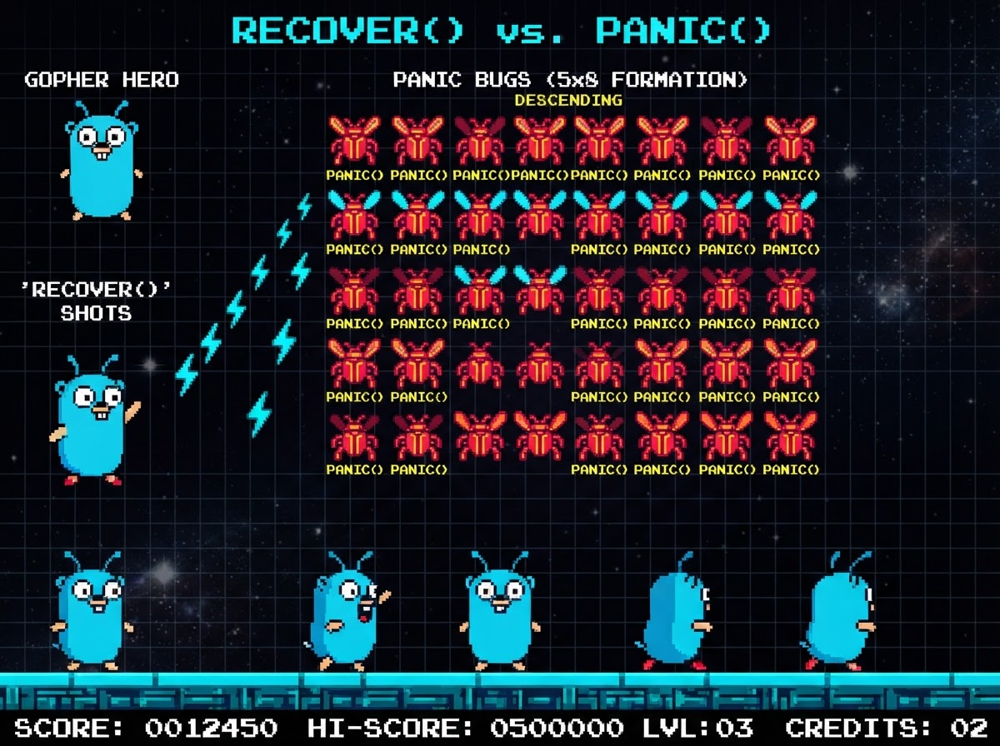

# Panic Invaders: In `recover()` We Trust
### GopherCon LATAM 2026 Mini Game Jam Edition

Um jogo arcade 2D estilo *Space Invaders* construído em Go com **Ebitengine v2** e **Antigravity**.



### 📹 Gameplay Demo

<video src="assets/game-play.mov" controls="controls" width="100%"></video>

> 🎥 Caso seu visualizador de Markdown não renderize o player de vídeo acima, acesse diretamente: [assets/game-play.mov](assets/game-play.mov)

---

## Autores

* **GopherCon LATAM 2026 Game Jam Team**

---

## História & Enredo

O auditório principal da **GopherCon LATAM 2026** está lotado para a Keynote de Abertura! No entanto, uma cascata descontrolada de goroutines causou uma tempestade maciça de `panic()` que invadiu os servidores da conferência.

Você assume o comando do **Gopher Defensor**, equipado com a lendária sub-rotina de emergência **`recover()`**, posicionado na base da Call Stack. Sua missão é proteger as barreiras `defer`, interceptar cada exceção em pleno ar e manter **100% de Uptime** para salvar a transmissão ao vivo!

---

## Controles

| Ação | Tecla Principal | Tecla Alternativa |
| :--- | :--- | :--- |
| **Mover para Esquerda** | `A` | `Seta para Esquerda` |
| **Mover para Direita** | `D` | `Seta para Direita` |
| **Disparar `recover()`** | `Espaço` | `J` |
| **Reiniciar (Game Over / Vitória)** | `Espaço` | `R` ou `Enter` |

---

## Como Executar

### Pré-requisitos
* Go 1.26+ instalado
* macOS / Linux / Windows

### Executando o Jogo

```bash
# Na raiz do jogo
cd parte3-mini-game-jam/panic-invaders

# Baixar dependências
go mod tidy

# Executar testes unitários
go test ./...

# Iniciar o jogo!
go run ./cmd/game
```

---

## Mecânicas do Jogo

### 👾 Inimigos: Os Bad Gophers (Vermelhos-Escuros / panic)
* **Bad Gopher Scout: `panic("nil pointer dereference")`** (30 pts): Linha superior, bad gopher esguio em vermelho-escuro com chifres que dispara ponteiros corrompidos.
* **Bad Gopher Spiky: `panic("index out of range")`** (20 pts): Linha do meio, movimentação veloz e olhos vermelhos incandescentes.
* **Bad Gopher Brute: `panic("integer divide by zero")`** (10 pts): Linha de frente, bad gopher pesado com dentes pontiagudos e alta cadência de disparos.
* **Bad Gopher Drone: `panic("wifi connection dropped")`** (250 pts): Drone voador dark-red que cruza o topo da tela e garante drop do crachá da GopherCon!
* **Corrupted Mega-Bad-Gopher Boss (Wave 3): `panic("deadlock: all 5000 goroutines asleep")`**: Chefão titânico em vermelho-escuro corrompido com barra de vida que dispara salvas de panics e exige dezenas de acertos de `recover()`.

### 🛡️ Barreiras `defer`
Três barreiras protetoras (`defer log.Flush()`, `defer db.Close()`, `defer mu.Unlock()`) que absorvem impactos de ambos os lados e sofrem desgaste destrutivo pixel-a-pixel.

### ⚡ Power-ups Go
* 🛡️ **`sync.Mutex`** (M): Escudo de exclusão mútua invulnerável por 8 segundos.
* ⚡ **`chan struct{}`** (C): Disparo contínuo triplo assíncrono por 8 segundos.
* ⏱️ **`context.WithTimeout`** (T): Desacelera a horda de invasores em 60% por 6 segundos.
* 🌟 **`GopherCon LATAM Badge`** (*): 500 pontos bônus e limpa instantaneamente todos os tiros de panic na tela!
