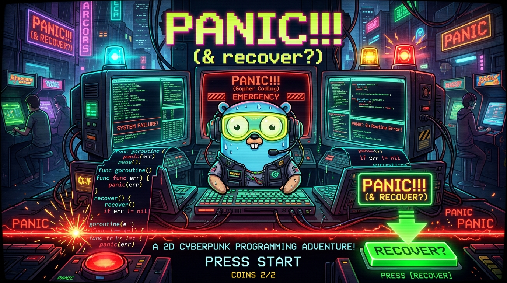

# Panic!!! (& recover?)

<p align="center">
  
</p>

<p align="center">
  <a href="https://pg06.github.io/gclatam26/" target="_blank">
    
  </a>
</p>

**🎮 Jogue Online no Navegador**: 👉 **[https://pg06.github.io/gclatam26/](https://pg06.github.io/gclatam26/)**

**Tema da Jam**: *Panic!!! (& recover?)*  
**Evento**: GopherCon LATAM 2026 - Mini Game Jam  
**Autores**: Equipe Panic Recover  

---

## Sobre o Jogo

*Panic!!! (& recover?)* é um jogo arcade de programação e reflexo rápido desenvolvido em Go com **Ebitengine v2**.

Linhas de código Go com bugs fatais caem da parte superior da tela em direção ao **Runtime Panic Horizon**, sincronizadas com um cronômetro de contagem regressiva de pânico. Seu objetivo como desenvolvedor Go é inspecionar o código, selecionar a linha causadora do crash com as setas do teclado, entrar no modo de edição inline e reescrever a linha com a correção adequada para disparar o `recover()` antes do encerramento fatal do processo!

### Destaques
- **10 Níveis Progressivos**: Cobre causas reais de panics em Go (nil pointer dereference, divisão por zero, index out of range em slices, atribuição em nil map, send em closed channel, double close, estouro de pilha por recursão infinita, type assertion incorreta, concorrência desprotegida em maps e goroutine sem defer recover).
- **Animação Estilo Tetris**: O bloco de código desce suavemente pela tela aumentando a urgência conforme os níveis avançam.
- **Gráficos Procedurais Retrô ("Retro-HD CRT")**: Linhas de scanline CRT, destaque de sintaxe procedural Go, laser de horizonte de pânico e partículas de faísca/glitch, 100% gerados em memória (zero arquivos de imagem externos).
- **Áudio DSP Procedural**: Efeitos sonoros sintetizados em tempo real (clique de teclado mecânico, bipe de navegação, sirene de alarme de pânico, fanfarra triunfal de recover e trilha sonora chiptune cyberpunk em loop).
- **Compatível com WebAssembly & Desktop**.

---

## Controles

| Ação | Teclas | Descrição |
| :--- | :--- | :--- |
| **Navegar Linhas** | `Seta Cima` / `Seta Baixo` ou `W` / `S` | Seleciona a linha de código |
| **Editar Linha** | `Enter` / `Espaço` / `E` | Inicia o modo de edição inline |
| **Digitação Livre** | Teclado alfanumérico + símbolos | Digite a correção da linha |
| **Submeter Correção**| `Enter` (em modo edição) | Avalia a correção e aciona `recover()` |
| **Cancelar Edição** | `Esc` | Cancela e volta para o modo navegação |
| **Dica de Diagnóstico**| `H` / `F1` | Alterna exibição da mensagem de erro e dica |
| **Mudo / Áudio** | `M` | Liga/Desliga os efeitos e música |
| **Tela Cheia** | `F11` ou `Alt + Enter` | Alterna modo tela cheia |

---

## Instruções de Execução

### Pré-requisitos
- Go 1.22+ instalado
- Dependências padrão de áudio/OpenGL do Ebitengine para o seu sistema operacional

### Rodando Localmente (Desktop)
```bash
cd panic-recover
go run .
```

### Rodando os Testes Automatizados
```bash
cd panic-recover
go test -v ./...
```

### Compilando para WebAssembly (WASM)
```bash
cd panic-recover
GOOS=js GOARCH=wasm go build -o game.wasm .
```
Para servir o jogo no navegador com um servidor estático local:
```bash
# Copie o wasm_exec.js do Go caso necessário:
cp "$(go env GOROOT)/lib/wasm/wasm_exec.js" .
```
